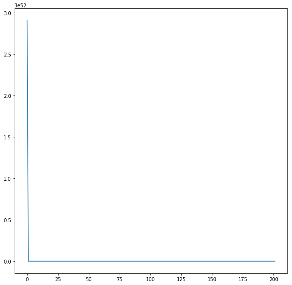

# Роевой алгоритм
Тип эволюционного алгоритма | Кодирование решения | Фитнес-функция
:---:|:---:|:---:|
[РА](https://en.wikipedia.org/wiki/Swarm_intelligence) | Вещественный вектор | [MD](https://en.wikipedia.org/wiki/Taxicab_geometry)

Разобраться в теоретическом описании математического метода оценки стоимости программного проекта –модели СОСОМО.
Из приведенной таблицы экспериментальных данных: [программных проектов НАСА](http://promise.site.uottawa.ca/SERepository/datasets/cocomonasa_2.arff)

Таблица входных данных
```
    (21000, 50000),
    (50000, 84000),
    (786000, 987000),
    (97000, 156000),
    (125000, 239000),
    (1008000, 1383000),
    (902000, 115800),
    (462000, 96000),
    (465000, 790000),
    (545000, 908000),
    (311000, 396000),
    (675000, 984000),
    (128000, 189000),
    (105000, 103000),
    (215000, 285000),
    (31000, 70000),
    (42000, 90000),
    (78000, 73000),
```
Число особей (N) | Число поколений (T)  | Ветер (С1) | Ветер (С2)
:---:|:---:|:---:|:---:|
70 | 200 | 1 | 1

- Результат РА: [0.99459901 1.02720453]
- Проверка на тестовой выборке: 2060428.4971592524

**График падения ошибки**


